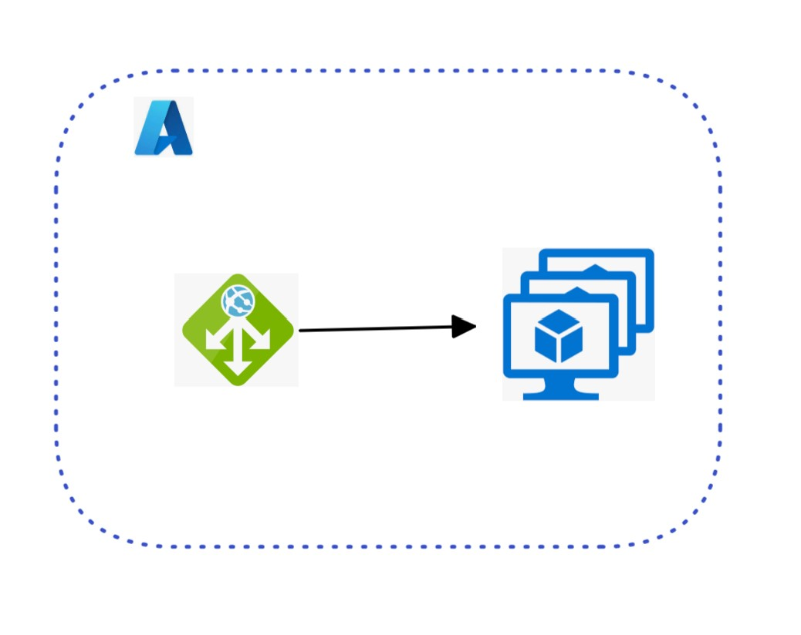

# Create a sample Azure Application Gateway with VM Scale Set as a backend
This project is to POC a sample Azure Application Gateway with VM Scale Set as a backend.
  
## Here are the tasks it does:   
1. Create Application Gateway
2. Create VMSS and attach it to previously created App GW as a backend. Ubuntu(20.04) image is used. 


## Prerequisites
1. Install terraform 1.3 or above


## Topology Diagram

## Usage
1. Copy sample.tfvars.bck to variables.tfvar
```dotnetcli
cp sample.tfvars.bck variables.tfvars
```
2. Replace sample values in variables.tfvars with your environment values
3. Initialize terraform
```dotnetcli
terraform init
```
4. Validate and plan terraform deployment
```dotnetcli
terraform validate
terraform plan
```
5. Deploy using terraform
```dotnetcli
terraform apply --auto-approve
```
6. Cleanup
```dotnetcli
terraform destroy
```

## Misc
### Alias
```dotnetcli
alias td='terraform destroy'
alias ti='terraform init'
alias tp='terraform plan'
alias ts='terraform show'
alias tv='terraform validate'
alias td='terraform destroy'
```
### Debug Terraform
```dotnetcli
export TF_LOG="DEBUG"
export TF_LOG="ERROR"
```

